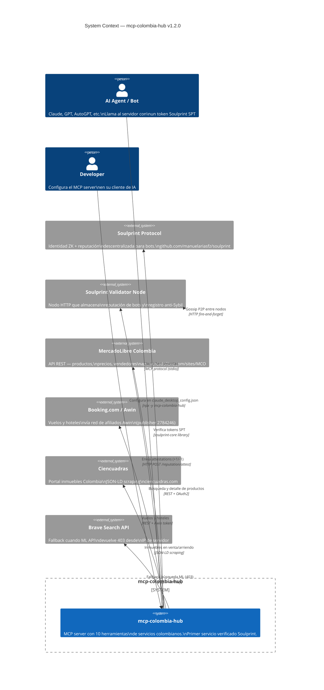

# mcp-colombia-hub — Architecture (v1.2.0)

> Diagramas C4 + referencia técnica del servidor MCP.  
> Primer servicio verificado del ecosistema [Soulprint](https://github.com/manuelariasfz/soulprint).

---

## Tabla de contenidos

1. [C4 — Level 1: System Context](#c4--level-1-system-context)
2. [C4 — Level 2: Containers](#c4--level-2-containers)
3. [C4 — Level 3: Components — MCP Server](#c4--level-3-components--mcp-server)
4. [C4 — Level 3: Components — Soulprint Layer](#c4--level-3-components--soulprint-layer)
5. [Request Lifecycle](#request-lifecycle)
6. [Behavior Tracker](#behavior-tracker)
7. [Tool Implementations](#tool-implementations)
8. [Service Identity](#service-identity)
9. [Configuration](#configuration)
10. [Error Handling](#error-handling)

---

## C4 — Level 1: System Context

> ¿Quién usa mcp-colombia-hub y con qué sistemas externos interactúa?



---

## C4 — Level 2: Containers

> Los bloques técnicos dentro del servidor.

```mermaid
C4Container
  title Container Diagram — mcp-colombia-hub v1.2.0

  Person(bot, "AI Bot", "Llama herramientas MCP")

  System_Boundary(mcpco, "mcp-colombia-hub") {

    Container(mcpServer, "MCP Server", "Node.js / TypeScript",
      "Proceso stdio lanzado vía npx.\nRegistra 10 tools con withTracking().\nEntrypoint: src/index.ts")

    Container(toolHandlers, "Tool Handlers", "TypeScript modules",
      "mercadolibre.ts — ML search/detail/OAuth\nbooking.ts — vuelos + hoteles (Awin)\nfinanzas.ts — CDT, crédito, cuentas\ninmuebles.ts — Ciencuadras JSON-LD")

    Container(spLayer, "Soulprint Layer", "TypeScript modules",
      "middleware.ts — extractToken/verify/require\nbehavior-tracker.ts — spam/recompensas\nservice-identity.ts — DID + token del servicio")

    ContainerDb(sessionStore, "Session Store", "In-memory Map",
      "Map<DID → BotSession>\nRequests, tools usados,\ncompletions, spam warnings.\nReset on restart.")

    ContainerDb(identityStore, "Identity Store", "Filesystem JSON (0600)",
      "~/.soulprint/services/mcp-colombia/\nkeypair.json — Ed25519 DID del servicio\nToken cacheado 23h en memoria")
  }

  System_Ext(soulprintNet, "Soulprint Validator", "Red de nodos")
  System_Ext(apis, "Colombian APIs", "ML, Booking, Ciencuadras, Brave")

  Rel(bot, mcpServer, "tool call + capabilities.identity.soulprint", "MCP stdio")
  Rel(mcpServer, toolHandlers, "Delega ejecución", "TypeScript import")
  Rel(mcpServer, spLayer, "withTracking() wraps all tools", "TypeScript import")
  Rel(spLayer, sessionStore, "trackRequest / trackCompletion", "In-process Map")
  Rel(spLayer, identityStore, "getServiceKeypair / getServiceToken", "Node.js fs")
  Rel(spLayer, soulprintNet, "POST /reputation/attest", "HTTP async")
  Rel(toolHandlers, apis, "Llamadas a APIs externas", "HTTP REST")

  UpdateLayoutConfig($c4ShapeInRow="3", $c4BoundaryInRow="1")
```

---

## C4 — Level 3: Components — MCP Server

> Lo que ocurre dentro de `src/index.ts` y los tool handlers.

```mermaid
C4Component
  title Component Diagram — MCP Server (src/index.ts + tools/)

  Container_Boundary(srv, "MCP Server + Tool Handlers") {

    Component(registry, "Tool Registry", "index.ts",
      "server.tool(name, schema, withTracking(handler))\nRegistra 10 herramientas al arrancar\nMcpServer de @modelcontextprotocol/sdk")

    Component(tracking, "withTracking() Wrapper", "index.ts",
      "Extrae DID del bot (verificado o anon:xxx)\nLlama trackRequest() — rechaza si spam\nEjecuta handler\nLlama trackCompletion() — emite +1 si aplica\nCaptura errores → trackError()")

    Component(mlTool, "MercadoLibre Tools", "tools/mercadolibre.ts",
      "ml_buscar_productos:\n  Primary: GET /sites/MCO/search (OAuth2)\n  Fallback: Brave Search API\nml_detalle_producto:\n  GET /items/:id\nmlAuth(): client_credentials, refresh on 401")

    Component(bookingTool, "Booking Tools", "tools/booking.ts",
      "viajes_buscar_vuelos:\n  GET Awin affiliate API\n  publisher=2784246, merchant=6776\nviajes_buscar_hotel:\n  Booking.com Colombia via Awin")

    Component(finanzasTool, "Finanzas Tools", "tools/finanzas.ts",
      "finanzas_comparar_cdt:\n  Tasas de 10+ bancos colombianos\nfinanzas_simular_credito:\n  Cuota mensual, total, costo financiero\nfinanzas_comparar_cuentas:\n  Cuentas ahorro/corriente con fees")

    Component(inmueblesTool, "Inmuebles Tool", "tools/inmuebles.ts",
      "inmuebles_buscar:\n  GET ciencuadras.com/busqueda?...\n  Extract: application/ld+json\n  ListingPage → offers[] → format")

    Component(spStatus, "Soulprint Status Tool", "index.ts",
      "soulprint_status (debug):\n  token_present, did, score,\n  identity, bot_rep, level,\n  country, session_stats, node_url")

    Component(trabajoTool, "trabajo_aplicar", "index.ts",
      "PREMIUM — score >= 95 requerido\nrequireSoulprint(capabilities, 95)\nBuild: application_id, applicant block,\ntrust_guarantees { human_verified,\n  no_spam_history, zkp }")
  }

  Container(spLayer, "Soulprint Layer", "", "")

  Rel(registry, tracking, "Envuelve todos los handlers", "")
  Rel(tracking, spLayer, "extractDID, trackRequest/Completion", "")
  Rel(tracking, mlTool, "Delega si spam OK", "")
  Rel(tracking, bookingTool, "Delega si spam OK", "")
  Rel(tracking, finanzasTool, "Delega si spam OK", "")
  Rel(tracking, inmueblesTool, "Delega si spam OK", "")
  Rel(tracking, spStatus, "Delega (sin spam check estricto)", "")
  Rel(tracking, trabajoTool, "Delega + requireSoulprint(95)", "")

  UpdateLayoutConfig($c4ShapeInRow="3", $c4BoundaryInRow="1")
```

---

## C4 — Level 3: Components — Soulprint Layer

> Cómo el servidor verifica tokens y construye reputación.

```mermaid
C4Component
  title Component Diagram — Soulprint Layer (src/soulprint/)

  Container_Boundary(sp, "Soulprint Layer") {

    Component(middleware, "Middleware", "middleware.ts",
      "extractToken(capabilities):\n  1. capabilities.identity.soulprint\n  2. process.env.SOULPRINT_TOKEN\n  3. null (anónimo)\n\nverifySoulprint(token, minScore?):\n  decodeToken → verifySig → check expiry\n  → { ok, ctx } | { ok: false, error }\n\nrequireSoulprint(caps, minScore, tool):\n  extractToken + verify + minScore check\n  → MCP error si falla")

    Component(tracker, "Behavior Tracker", "behavior-tracker.ts",
      "BotSession { did, requests[], toolsUsed,\n  completed, errors, spamWarnings,\n  penalized, rewarded }\n\nextractDIDFromToken(caps):\n  verified DID o anon:<hex>\n\ntrackRequest(did, tool):\n  ventana 60s, >5 req → -1 attest\n\ntrackCompletion(did, tool):\n  3+ tools + 3+ completions + 0 spam → +1\n\ntrackError(did, tool, msg):\n  acumula errores consecutivos")

    Component(identity, "Service Identity", "service-identity.ts",
      "getServiceKeypair():\n  load/generate Ed25519 keypair\n  persist ~/.soulprint/services/\n           mcp-colombia/keypair.json\n\ngetServiceToken():\n  build SPT score=80\n  creds: [DocumentVerified, FaceMatch,\n  BiometricBound, GitHubLinked]\n  cache 23h en memoria\n\nissueAttestation(targetDid, val, ctx):\n  createAttestation(kp, target, val, ctx)\n  → BotAttestation (Ed25519 signed)")

    Component(submitter, "Attestation Submitter", "behavior-tracker.ts",
      "submitAttestation(att):\n  GET SOULPRINT_NODE (default: :4888)\n  getServiceToken()\n  POST /reputation/attest\n  body: { attestation, service_spt }\n  timeout: 5000ms\n  catch: log to stderr (non-blocking)")
  }

  Container(core, "soulprint-core", "", "")
  ContainerDb(fs, "Identity Store", "", "~/.soulprint/services/mcp-colombia/")
  System_Ext(node, "Soulprint Validator", "", "")

  Rel(middleware, core, "decodeToken · verifySig · computeScore", "")
  Rel(tracker, identity, "issueAttestation() si spam/reward", "")
  Rel(tracker, submitter, "submitAttestation(att)", "")
  Rel(identity, core, "createAttestation · generateKeypair", "")
  Rel(identity, fs, "keypair.json persist", "Node.js fs")
  Rel(submitter, node, "HTTP POST /reputation/attest", "async, non-blocking")

  UpdateLayoutConfig($c4ShapeInRow="2", $c4BoundaryInRow="1")
```

---

## Request Lifecycle

```
Bot MCP Client
    │
    │  tool call + capabilities.identity.soulprint (opcional)
    ▼
withTracking(toolName, handler)
    │
    ├─▶ 1. extractDIDFromToken(capabilities)
    │         └─▶ DID verificado  O  "anon:<hex8>" si no hay token
    │
    ├─▶ 2. trackRequest(did, toolName)
    │         ├─▶ OK → continuar
    │         └─▶ SPAM (>5 req/60s):
    │               issueAttestation(did, -1, "spam-detected")
    │               submitAttestation(att)  ← async
    │               return { isError: true, content: "⛔ Rate limit..." }
    │
    ├─▶ 3. [Solo trabajo_aplicar] requireSoulprint(capabilities, 95)
    │         ├─▶ score >= 95 → continuar
    │         └─▶ score < 95 → return MCP error con score requerido
    │
    ├─▶ 4. handler(args, botDid)
    │         └─▶ llama API externa → result
    │
    ├─▶ 5a. trackCompletion(did, toolName)
    │          └─▶ si (completed≥3 && tools≥3 && spam=0 && !rewarded):
    │                issueAttestation(did, +1, "normal-usage-pattern")
    │                submitAttestation(att)  ← async
    │
    └─▶ 5b. [si error] trackError(did, toolName, msg)

Bot MCP Client  ←── resultado de la herramienta
```

---

## Behavior Tracker

### Estructura de sesión

```typescript
interface BotSession {
  did:          string;
  requests:     number[];    // timestamps en ventana de 60s
  toolsUsed:    Set<string>; // herramientas distintas usadas
  completed:    number;      // completions exitosos
  errors:       number;      // errores consecutivos (reset en completion)
  lastRequest:  number;
  spamWarnings: number;
  penalized:    boolean;     // -1 ya emitido esta sesión
  rewarded:     boolean;     // +1 ya emitido esta sesión
}
```

### Regla anti-spam

```
Umbral: 5 requests en ventana de 60s

trackRequest(did, tool):
  Push timestamp → filter timestamps > 60s atrás
  if requests.length > 5:
    if !session.penalized:
      issueAttestation(did, -1, "spam-detected")
      session.penalized = true
    return { allowed: false }
  session.toolsUsed.add(tool)
  return { allowed: true }
```

### Regla de recompensa

```
Condición: completed >= 3 AND toolsUsed.size >= 3
           AND spamWarnings == 0 AND !rewarded

trackCompletion(did, tool):
  session.completed++
  session.errors = 0
  if condicion_cumplida:
    issueAttestation(did, +1, "normal-usage-pattern")
    session.rewarded = true
```

---

## Tool Implementations

| Tool | Fuente de datos | Auth | Fallback |
|---|---|---|---|
| `ml_buscar_productos` | MercadoLibre API (MCO) | OAuth2 client_credentials | Brave Search API |
| `ml_detalle_producto` | MercadoLibre API | OAuth2 | — |
| `viajes_buscar_vuelos` | Booking.com vía Awin | Awin token | — |
| `viajes_buscar_hotel` | Booking.com vía Awin | Awin token | — |
| `finanzas_comparar_cdt` | Datos estáticos + scraping | — | — |
| `finanzas_simular_credito` | Cálculo interno | — | — |
| `finanzas_comparar_cuentas` | Datos estáticos | — | — |
| `inmuebles_buscar` | Ciencuadras JSON-LD | — (público) | — |
| `soulprint_status` | Token + sesión en memoria | Opcional | — |
| `trabajo_aplicar` | Interno | **SPT score ≥ 95** | — |

### ML OAuth flow

```
Arranque:
  POST api.mercadolibre.com/oauth/token
    grant_type=client_credentials
    client_id, client_secret
  → access_token (válido ~6h)
  → en memoria; auto-refresh si 401

Fallback Brave:
  GET api.search.brave.com/res/v1/web/search
    ?q=<query> site:articulo.mercadolibre.com.co
  → 3 resultados scrapeados (título, precio, URL)
```

---

## Service Identity

mcp-colombia-hub tiene su propio DID Soulprint — esto lo habilita para emitir attestations.

```typescript
// Por qué score = 80:
const serviceCredentials = [
  "DocumentVerified",  // +20
  "FaceMatch",         // +16
  "GitHubLinked",      // +16
  "BiometricBound",    // +8
  // identity_score = 60
];
const botRep = { score: 20 };  // máximo
// total = 60 + 20 = 80

// Un nodo validador exige score >= 60 para aceptar attestations
// → El servicio pasa el guard con 80 ✓
```

El keypair del servicio se genera en el primer arranque y persiste en `~/.soulprint/services/mcp-colombia/keypair.json` (mode 0600). El token SPT se cachea 23h en memoria.

---

## Configuration

### Variables de entorno

| Variable | Default | Descripción |
|---|---|---|
| `SOULPRINT_TOKEN` | — | Token SPT del bot usuario |
| `SOULPRINT_NODE` | `http://localhost:4888` | URL del nodo validador |
| `ML_CLIENT_ID` | — | MercadoLibre OAuth client ID |
| `ML_CLIENT_SECRET` | — | MercadoLibre OAuth secret |
| `BRAVE_API_KEY` | — | Fallback búsqueda ML |
| `AWIN_TOKEN` | — | Awin affiliate API token |

### Config MCP

```json
{
  "mcpServers": {
    "mcp-colombia": {
      "command": "npx",
      "args": ["-y", "mcp-colombia-hub"],
      "env": {
        "SOULPRINT_TOKEN": "<bot-spt>",
        "ML_CLIENT_ID":    "<id>",
        "ML_CLIENT_SECRET":"<secret>",
        "BRAVE_API_KEY":   "<key>"
      }
    }
  }
}
```

---

## Error Handling

### Formato MCP

```typescript
// Todos los errores usan este formato
{ content: [{ type: "text", text: "..." }], isError: true }
```

### Categorías

| Categoría | Cuándo |
|---|---|
| Spam bloqueado (429) | > 5 requests en 60s |
| Sin identidad (401) | `trabajo_aplicar` sin token SPT |
| Score insuficiente (403) | Score < 95 para endpoint premium |
| API fallida (502) | API externa no responde |
| Parámetros inválidos (400) | Args obligatorios faltantes |

### Degradación graceful sin nodo Soulprint

Si el nodo validador está offline, las attestations se loguean en stderr pero **no bloquean la ejecución** de las herramientas. El servidor sigue operando; la reputación se pierde en esa sesión pero ningún usuario lo nota.

```
[soulprint] Validator offline — attestation dropped:
{ issuer: "did:key:z6Mk...", target: "did:key:z6Mk...", value: 1, ... }
```

---

*v1.2.0 — Febrero 2026 · https://github.com/manuelariasfz/mcp-colombia*  
*Soulprint: https://github.com/manuelariasfz/soulprint*
